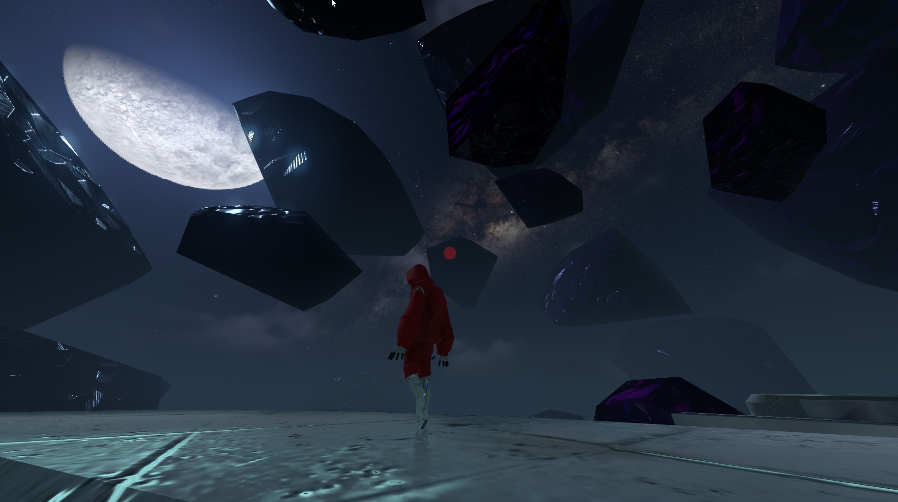

# Tumble game-play demo

**HyperGodot Demo of a Third-Person Controller**

This is a very basic demo with a few bugs. It's main goal is to showcase a third person game that uses the [hypercore protocol](https://hypercore-protocol.org/) for multiplayer. We hope this can serve as a resource for others who may wish to use hypercore for p2p 3d multiplayer games.

# Controls
* wsad for movement 
* left mouse click for grappling hook 
* "x" for light toggle
* space bar for jump
* "r" to respawn

# Credits
* Dresk - programming 
* Mauve - programming 
* Fleeky - Modelling / Animation 
* Ashes - Art Direction / Sounds 

# More information
* Download both the PCK file and the binary 
* Linux : chmod +x binary in order to run it
* hypercore-gateway uses a slightly older version of hypercore. while hole punching is good , some router configurations do require you to open port 4973.
